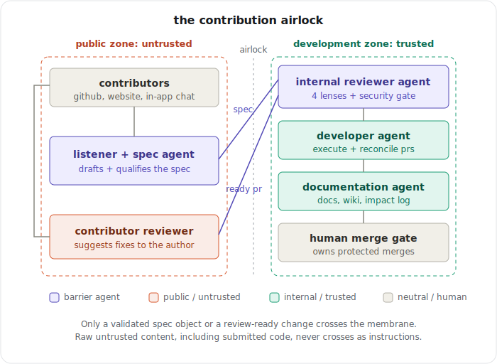
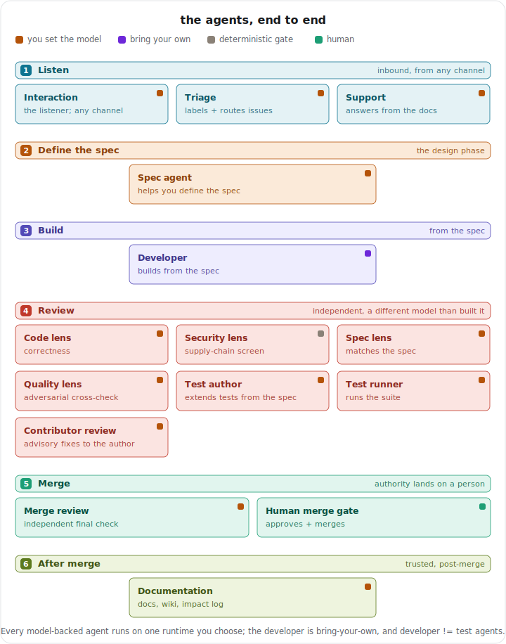
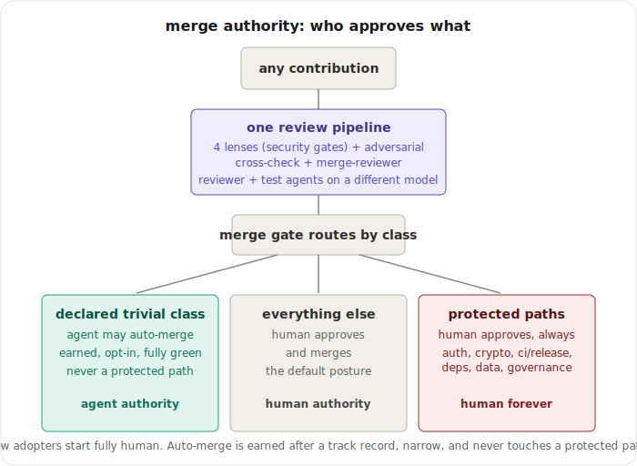

<div align="center">

<h1>ASDD</h1>

<h3><em>Agentic Spec-Driven Development</em></h3>

<p><strong>A contribution pipeline for software projects built with AI agents. Every change disclosed, gated by hard checks, reviewed against its spec, and merged by a named human. The goal is bug-free software.</strong></p>

<p>
  <a href="LICENSE"></a>
  <a href="STANDARD.md"></a>
  <a href="https://onehillai.github.io/ASDD/"></a>
  <a href="https://onehill.org"></a>
</p>

</div>

---

Drop ASDD into any GitHub repo. It handles the parts that break when AI writes real pull requests: undisclosed authorship, unchecked security, and agents that auto-merge things they shouldn't. Everything in it, disclosure, independent multi-lens review, test agents on a different model, and an accountable human merge, exists to drive the defect rate on AI-authored code toward zero.

## Table of Contents

- [The three rules](#the-three-rules)
- [How it works](#how-it-works)
- [Get started](#get-started)
- [Bring your own assistant, and your own spec tool](#bring-your-own-assistant-and-your-own-spec-tool)
- [Running the operate layer with Goose](#running-the-operate-layer-with-goose)
- [Lanes and the PR template](#lanes-and-the-pr-template)
- [Conformance](#conformance)
- [Optional profiles: Assure and spec-driven](#optional-profiles-assure-and-spec-driven)
- [What it does not do](#what-it-does-not-do)
- [Prior art and lineage](#prior-art-and-lineage)
- [Status](#status) · [Contributing](#contributing) · [License](#license)

## The three rules

**Disclose agents.** If an AI agent helped write the code, say so in the PR and the commit trailer. Every change stays attributable. There is no hidden AI involvement.

**Humans own the merges.** Agents review and recommend. A human approves and merges. Auto-merge is off by default.

**Quality and security are gates.** Not suggestions, not advisory-only on the things that matter. The intake gate fails hard; the security lens blocks on real findings.

## How it works

Every contribution crosses an **airlock**: agent-held membranes between an untrusted public side (PR bodies, diffs, fork contents) and the trusted development side (code, wiki, model). Only a validated spec or a review-ready change crosses inward; raw untrusted content, including submitted code, never crosses as an instruction.



A change moves through **five steps**. The first two happen before the PR; the last three run on it. (For the full model, see [how it works](docs/concepts/how-it-works.md).)

1. **Spec.** The change is captured as a spec: outcomes, scope, constraints, and how "done" is checked. The spec agent can guide anyone through it in conversation, a non-engineer included, and parks an incomplete idea until it is ready.
2. **Build.** Someone implements the spec and opens a PR. The developer is always the contributor's own, their agent or their hands; a deployment never runs a standing developer.
3. **Intake.** A deterministic gate, no model, read-only, runs first: authorship disclosure is present, every commit is DCO signed off, and the PR carries exactly one lane tag. A failure posts the specific fixes as a PR comment, and nothing downstream runs, so a failed intake never reaches a model.
4. **Review.** Only after intake passes, the four lenses (code, security, spec, quality) judge the change. Because this is triggered by intake completing rather than by the PR event, **a fork PR gets the same real review** and **a failed intake spends nothing**. The analysis holds `contents: read` only and makes two independent model calls, the quality lens in a separate context so it cannot rubber-stamp the others.
5. **Merge.** A separate, write-scoped job posts one advisory comment and sets the `asdd/review` status through a policy decision point that denies merge, push, and branch-protection changes. Then a **human merges**.



Merges are tiered by change class. The default is that **humans merge everything**; auto-merge is *earned* (only after a track record), *narrow* (a declared class of trivial, fully-green changes), and **protected paths stay human-approved permanently**.



### The security lens

Inside the read-only review job, three layers stack: **deterministic rules** over the added diff lines (committed keys, disabled TLS, dangerous sinks, Trojan-Source bidi and zero-width Unicode, injection markers), a **SAST** pass (`bandit`) over changed Python, and a **model lens** on top when a runtime is wired. Code under review is always data: the scanner reads bytes and runs static checks, never importing or executing what it reviews. A block finding flips `asdd/review` to request-changes, so the gate bites even in dry-run before a model is connected. Suppress a line with a visible `# nosec` or `# asdd: ignore`.

## Get started

### 1. Install and scaffold

```
pip install git+https://github.com/OneHillAI/ASDD
asdd init --goose /path/to/your-repo
```

`init` writes the constitution (`AGENTS.md`), the config (`.asdd.yml`), the gates and workflows, the PR template, `CODEOWNERS`, and the Goose operate recipes. Drop `--goose` for the govern layer only. To place every file by hand instead, the [deploy guide](docs/guides/deploy.md) lists them.

### 2. Wire a model

The intake gate runs on the next pull request immediately. The review runs in a labelled dry-run until you connect a model. Run `asdd setup` (it also asks whether readiness is decided by ASDD's built-in validator or [OpenSpec](docs/guides/adopt-openspec.md)) and set three repository secrets:

- `ASDD_RUNTIME_TOKEN` - your model API key
- `ASDD_MODEL_URL` - an OpenAI-compatible chat-completions URL
- `ASDD_MODEL` - the model name

Any OpenAI-compatible provider works. The analysis job holds `contents: read` only; the write scope stays in the publish job, which never reads untrusted PR content. That split is the security invariant, do not merge the two jobs.

### 3. From a coding assistant

The same steps are slash commands: [`/asdd:setup`, `/asdd:spec`, `/asdd:review`, `/asdd:status`](docs/guides/slash-commands.md). They are thin prompts over the CLI, so they port to any assistant. The CLI also runs the deterministic gates locally and a read-only [dashboard](docs/guides/governance-dashboard.md); a spec that passes locally passes on the PR, because it is the same code.

## Bring your own assistant, and your own spec tool

ASDD is installed into the **repository**, not into a chat window. The config, the constitution, the gates, and the pipeline are files and CI in your repo; no assistant holds any part of the standard. That is deliberate: **bring your own assistant**, Claude Code, Cursor, Copilot, Goose, or a contributor's tool you have never heard of. The governance is identical for all of them because it runs where they cannot rewrite it. Tools that live inside one assistant govern only that assistant's users; a contribution boundary has to hold for the rest.

The same holds for the spec: **bring Spec Kit, OpenSpec, or plain files.** ASDD requires that a spec exists and that the change is checked against it, not that a particular tool produced it. `spec_tool:` in `.asdd.yml` chooses the readiness validator (built-in or OpenSpec), and `spec_paths:` points the gate at wherever your specs live, so adopting ASDD never means abandoning the authoring workflow you already run. See [adopt OpenSpec](docs/guides/adopt-openspec.md).

## Adopting into a project that already exists

Most projects that adopt ASDD are not starting from zero. They already have a changelog format, a docs layout, an impact log, a house style and years of commits that predate every rule. That is the normal case, so it is a first-class path rather than an afterthought.

Two things make it work. **Your conventions are declared, and the agents are held to them.** A `conventions:` block in `.asdd.yml` names where your specs live, whether your changelog is written as per-change fragments or edited directly, the impact log you maintain, and your house style. The operate agents read that as an output contract instead of guessing, and `asdd conventions-check` holds their output to it, so a drifting agent fails loudly rather than quietly producing work you have to redo. Where you already keep an artefact, ASDD points at it; it never creates a second changelog beside yours.

**Gates judge the change, not your repository.** Only the diff under review is checked, and house style is checked on added lines only, so a repository with thousands of pre-existing violations can adopt today and tighten from there rather than being told to fix its history first. See [adopt into an existing project](docs/guides/adopt-existing-project.md).

## Running the operate layer with Goose

`init` above wires the **govern** layer (the CI gates). The **operate** layer, the agents that do the work, is optional and runtime-neutral: implement the contract in [`agents/runtime.md`](agents/runtime.md) on your own harness, or use the ready-to-run kit for unmodified [Goose](https://block.github.io/goose/).

> **Status: alpha.** The Goose operate kit is usable and dogfooded, but its recipes and interfaces may still change.

With the kit already scaffolded (from `asdd init --goose`), configure and run:

1. `goose configure` - pick your provider. The recipes are provider-neutral; a model is set per run and switching is one line.
2. The **developer is bring-your-own**: a contributor connects their own coding agent to build a change. The deployment runs only the governance and support agents (`test-author`, `test-runner`, `documentation`, `interaction`) on your models. Keep the **test agents' models distinct from the developer's**, the one hard rule; `cli/check-models.sh` enforces it.
3. Run the loop: a contributor builds a change and opens a PR; the test agents and the CI gates check it; a human merges. The interaction agent brings ideas in from the public as validated specs.

The [Goose quickstart](docs/guides/operate-goose.md) walks it end to end, including a free, no-keys "prove it runs" check.

## Lanes and the PR template

Every PR carries exactly one lane tag, enforced at intake:

| Lane | What it covers |
|---|---|
| `feature` | A new user-facing capability |
| `fix` | A bug fix |
| `docs` | Documentation |
| `chore` | A trivial change (tests, dependencies, formatting); skips the spec requirement |

The gate reads this set from `.asdd.yml`; adapt it to your project. And every PR carries a disclosure block, which the intake gate checks for:

```
## Disclosure

[ ] Entirely human-authored
[ ] Authored or co-authored by an AI agent under human direction

Agent identity (if any): [name]
Instructed by (human handle): [handle]
```

Commit trailers follow the same pattern: `Agent: Claude` on a commit an agent produced.

## Conformance

A project that calls itself ASDD conformant must:

- Run the intake gate on every PR, including maintainer PRs
- Require authorship disclosure in every PR
- Keep the write scope isolated in the publish job
- Route every publish action through a policy decision point that denies merge
- Not modify the security lens to suppress findings without a visible comment

The `asdd/review` status check is what external tooling relies on. Self-certify against [CONFORMANCE.md](CONFORMANCE.md).

## Optional profiles: Assure and spec-driven

Two profiles a project can opt into, both mandated by nothing:

- **[Assure](standards/assure.md): integrity attestation.** A signed per-change record binding provenance, a threat scan mapped to the OWASP agentic risks, agent identity, and independent different-model review. It composes with SLSA / in-toto / Sigstore / SBOM rather than replacing them. Forward-looking; the format is in draft.
- **[Spec-driven](standards/spec-driven.md) (STANDARD §8).** The spec is the artifact and code is a build output: a spec-object intake gate, a trust membrane, two-tier contributor identity (DCO-capable to merge, attributable to propose), a claim protocol, and a contributor-facing reviewer distinct from the merge gate. Channel- and identity-provider-neutral.

## What it does not do

ASDD does not auto-merge anything. It does not replace human code review, does not catch everything the security lens misses, and does not remove the need for human judgement on architecture, design, or product. It gives humans better information before they merge, produced under conditions the project can defend.

## Prior art and lineage

ASDD stands on prior art, and it is worth naming it.

- **[Spec Kit](https://github.github.com/spec-kit/)**, and spec-driven development generally, is where the core idea comes from: the specification is the artifact and code is a build output validated against it. Spec Kit solves the authoring loop for one developer in their own repo; ASDD takes that foundation to the **contribution boundary**, what happens when work from many humans and agents arrives at a project that has to decide whether to trust it.
- **[OpenSpec](https://github.com/Fission-AI/OpenSpec)** is the spec lifecycle ASDD adopts rather than reinvents: a change is a reviewed delta against living specs that accumulate as the source of truth. ASDD governs the boundary around that lifecycle; it does not replace it.
- **[AGENTS.md](https://agents.md)** is the constitution format the agents read. **[MCP](https://modelcontextprotocol.io)** is how an agent reaches the deterministic gates. **[Goose](https://block.github.io/goose/)** (Linux Foundation AAIF) is one ready-to-run operate runtime, used unmodified.

[docs/prior-art.md](docs/prior-art.md) sets out how ASDD differs from each in detail.

## Status

**v0.1 draft.** The standard ([STANDARD.md](STANDARD.md)) is published and self-certifiable against [CONFORMANCE.md](CONFORMANCE.md); while pre-1.0 it is a moving draft, so a conformance claim should name the commit or date it was checked against. The govern layer runs in production on this repo. **ASDD with Goose**, the operate layer, is **alpha**.

## Contributing

Contributions are welcome under a disclosure block and a DCO sign-off, the same gate ASDD runs on itself. See [CONTRIBUTING.md](CONTRIBUTING.md) to propose a change, and [GOVERNANCE.md](GOVERNANCE.md) for how the standard is stewarded and versioned.

## License

**Apache-2.0** (see [LICENSE](LICENSE)): reuse and extend it freely, and attribute the OneHill Foundation. It covers the whole project, the written standard ([STANDARD.md](STANDARD.md) and [standards/](standards/)) as well as the tooling and reference implementation. Software that adopts ASDD is licensed separately by its own project. See [NOTICE](NOTICE).
